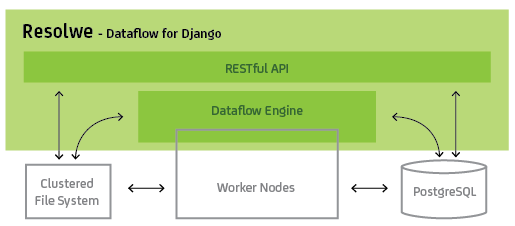
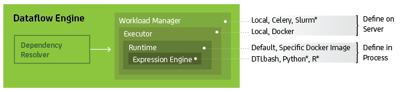
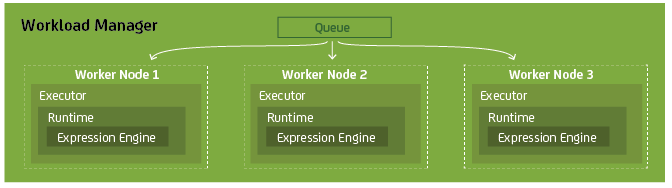

========
Overview
========

Resolwe consists of two major components: a RESTful API and the Flow Engine.
The RESTful API is based on the `Django REST Framework`_ and offers complete
control over the workflow, the data involved and the permissions on those data.
The Resolwe Flow engine, on the other hand, handles pipeline execution. It
resolves dependencies between `processes` (jobs or tasks), and executes them on
worker nodes. Results are saved to a PostgreSQL database and a clustered file
system.

.. _Django REST Framework: http://www.django-rest-framework.org

The Flow Engine has several layers of execution that can be configured either on
the server or by the individual processes.

Processes can be executed on a server cluster. In this case the Executor,
Runtime and Expression Engine layers span multiple worker nodes.

Resolwe can be configured for lightweight desktop use (`e.g.,` by bioinformatics
professionals) or deployed as a complex set-up of multiple servers and worker
nodes. In addition to the components described above, customizing the
configuration of the web server (`e.g.,` NGINX or Apache HTTP), workload
manager, and the database offer high scaling potential.

Example of a lightweight configuration: synchronous workload manager that runs
locally, Docker executor and runtime, Django web server, and local file system.

Example of a complex deploy: Slurm workload manager with a range of
computational nodes, Docker executor and runtime on each worker node, NGINX web
server, and a fast file system shared between worker nodes.
