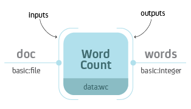
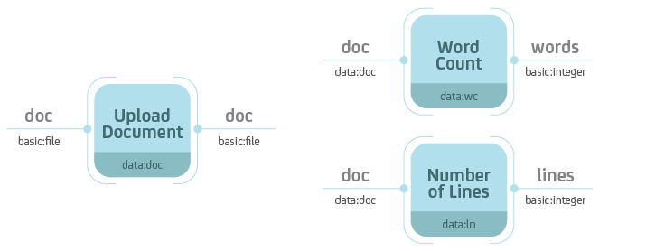
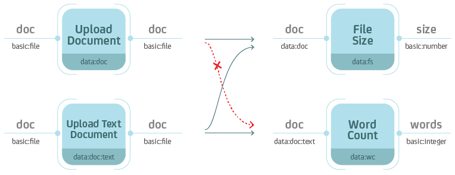

=================
Writing processes
=================

Process is a central building block of the Resolwe's dataflow. Formally, a
process is an algorithm that transforms inputs to outputs. For example, a `Word
Count` process would take a text file as input and report the number of words
on the output.



    `Word Count` process with input ``doc`` of type ``basic:file`` and output
    ``words`` of type ``basic:integer``.

When you execute the process, Resolwe creates a new ``Data`` object with
information about the process instance. In this case the `document` and the
`words` would be saved to the same ``Data`` object. What if you would like
to execute another analysis on the same document, say count the number of
lines? We could create a similar process `Number of Lines` that would also take
the file and report the number of lines. However, when we would execute the
process we would have 2 copies of the same `document` file stored on the
platform. In most cases it makes sense to split the upload (data storage) from
the analysis. For example, we could create 3 processes: `Upload Document`,
`Word Count` and `Number of Lines`.




    Separate the data storage (`Upload Document`) and analysis (`Word Count`,
    `Number of Lines`). Notice that the `Word Count` and `Number of Lines`
    processes accept ``Data`` objects of type ``data:doc``---the type ot the
    `Upload Document` process.

Resolwe handles the execution of the dataflow automatically. If you were to
execute all three processes at the same time, Resolwe would delay the execution
of `Word Count` and `Number of Lines` until the completion of `Upload
Document`. Resolwe resolves dependencies between processes.

A processes is defined by:

- Inputs
- Outputs
- Meta-data
- Algorithm

Processes are stored in the data base in the ``Process`` model. A process'
algorithm runs automatically when you create a new ``Data`` object. The inputs
and the process name are required at ``Data`` create, the outputs are saved by
the algorithm, and users can update the meta-data at any time. The
:ref:`process-syntax` chapter explains how to add a process definition to the
``Process`` data base model

Processes can be chained into a dataflow. Each process is assigned a type
(`e.g.,` ``data:wc``). The ``Data`` object created by a process is implicitly
assigned a type of that process. When you define a new process, you can specify
which data types are required on the input. In the figure below, the `Word
Count` process accepts ``Data`` objects of type ``data:doc`` on the input.
Types are hierarchical with each level of the hierarchy separated by a colon.
For instance, ``data:doc:text`` would be a sub-type of ``data:doc``. A process
that accepts ``Data`` objects of type ``data:doc``, also accepts ``Data``
objects of type ``data:doc:text``. However, a process that accepts ``Data``
objects of type ``data:doc:text``, does not accept ``Data`` objects of type
``data:doc``.



   Types are hierarchical. When you define the type on the input, keep in mind
   that the process should also handle all sub-types.

.. _process-syntax:

Process syntax
==============

A process can be written in any syntax as long as you can save it to the
``Process`` model. The most straight-forward would be to write in Python, using
the Django ORM::

    p = Process(name='Word Cound',
                slug='wc-basic',
                type='data:wc:',
                inputs = [{
                    'name': 'document',
                    'type': 'basic:file:'
                }],
                outputs = [{
                    'name': 'words',
                    'type': 'basic:integer:'
                }],
                run = {
                    'bash': 'WORDS=`wc {{ document.file }}\n`' +
                            'echo {"words": $WORDS}'
                })
    p.save()


We suggest to write processes in the YAML syntax. Resolwe includes a
``register`` Django command that parses .yml files in the ``processes``
directory and adds the discovered processes to the ``Process`` model::

    ./manage.py register

Do not forget to re-register the process after you make changes to the .yml
file. You have to increase the process version each time you register it. For
development, you can use the ``--force`` option (or ``-f`` for short)::

    ./manage.py register -f

This is an example of :download:`the smallest processor
<example/example/processes/minimal.yml>` in YAML syntax:

.. literalinclude:: example/example/processes/minimal.yml
   :language: yaml
   :linenos:

This is the example of the :download:`basic Word Count
<example/example/processes/example_basic.yml>` implementation in the YAML
syntax (with the document file as input):

.. literalinclude:: example/example/processes/example_basic.yml
   :language: yaml
   :linenos:

If you would like to review the examples of the three processes mentioned above
(`Upload Document`, `Word Count` and `Number of Lines`), :download:`follow this
link <example/example/processes/example.yml>`. Read more about the process
options in :ref:`process-schema` below.

.. _process-schema:

Process schema
==============

Process is defined by a set of fields in the ``Process`` model.  We will
describe how to write the process schema in YAML syntax. Some fields in the
YAML syntax have different name or values than the actual fields in the
``Process`` model. See an :download:`example of a process with all fields
<example/example/processes/all_fields.yml>`. Fields in a process schema:

================================ ===================== ======== ==============
Field                            Short description     Required Default
================================ ===================== ======== ==============
:ref:`slug <slug>`               unique id             required
:ref:`name <name>`               human readable name   required
:ref:`description <description>` detailed description  optional <empty string>
:ref:`version <version>`         version numbering     optional
:ref:`type <type>`               data type             required
:ref:`category <category>`       menu category         optional <empty string>
:ref:`entity <entity>`           automatic grouping    optional
:ref:`persistence <persistence>` storage optimization  optional RAW
:ref:`scheduling_class <sch>`    scheduling class      optional batch
:ref:`input <io>`                list of input fields  optional <empty list>
:ref:`output <io>`               list of result fields optional <empty list>
:ref:`run <run>`                 the algorithm         required
:ref:`requirements <reqs>`       requirements          optional <empty dict>
================================ ===================== ======== ==============

.. _slug:

Slug
----

TODO

.. _name:

Name
----

TODO

.. _description:

Description
-----------

TODO

.. _version:

Version
-------

TODO

.. _type:

Type
----

TODO

.. _category:

Category
--------

The category is used to arrange processes in a GUI. A category can be any
string of lowercase letters, numbers, - and :. The colon is used to split
categories into sub-categories (`e.g.,` ``analyses:alignment``).

We have predefined three top categories: upload, import and analyses. Processes
without this top category will not be displayed in the GenBoard interface, but
will be available on the platform.

.. _entity:

Entity
------

With defining the ``entity`` field in the process, new data objects will be
automatically attached to a new or existing Entity, depending on it's parents
and the definition of the field.

``entity`` field has 3 subfields:

* ``type`` is required and defines the type of entity that the new ``Data``
  object is attached to
* ``input`` limits the group of parents' entities to a single field (dot
  separated path to the field in the definition of input)
* ``descriptor_schema`` specifies the slug of the descriptor schema that is
  attached to newly created entity. It defaults to the value of ``type``

.. _persistence:

Persistence
-----------

Use RAW for imports. CACHED or TMP processes should be idempotent.

.. _sch:

Scheduling class
----------------

The scheduling class specifies how the process should be treated by the
scheduler. There are two possible values:

* ``batch`` is for long running tasks, which require high throughput.
* ``interactive`` is for short running tasks, which require low latency.
  Processes in this scheduling class are given a limited amount of time
  to execute (default: 30 seconds).

The default value for processes is ``batch``.

.. _io:

Input and Output
----------------

A list of `Resolwe Fields` that define the inputs and outputs of a process. A
`Resolwe Field` is defined as a dictionary of the following properties:

Required `Resolwe Field` properties:

- ``name`` - unique name of the field
- ``label`` - human readable name
- ``type`` - type of field (either ``basic:<...>`` or ``data:<...>``)

Optional `Resolwe Field` properties (except for ``group``):

- ``description`` - displayed under titles or as a tooltip
- ``required`` - (choices: `true`, `false`)
- ``disabled`` - (choices: `true`, `false`)
- ``hidden`` - (choices: `true`, `false`)
- ``default`` -  initial value
- ``placeholder`` - placeholder value displayed if nothing is specified
- ``validate_regex`` - client-side validation with regular expression
- ``choices`` - list of choices to select from (``label``, ``value`` pairs)

Optional `Resolwe Field` properties for ``group`` fields:

- ``description`` - displayed under titles or as a tooltip
- ``disabled`` - (choices: `true`, `false`)
- ``hidden`` - (choices: `true`, `false`)
- ``collapsed`` - (choices: `true`, `false`)
- ``group`` - list of process fields

TODO: explain what is field schema. For field schema details see
fieldSchema.json.

.. _run:

Run
---

The algorithm that transforms inputs into outputs. Bash and workflow languages
are currently supported and we envision more language support in the future (`e.g.,`
directly writing processes in Python or R). Commands should be written to a
``program`` subfield.

TODO: link a few lines from the all_fields.yml process

.. _reqs:

Requirements
------------

A dictionary defining optional features that should be available in order for the process
to run. There are several different types of requirements that may be specified:

- ``expression-engine`` defines the name of the engine that should be used to evaluate
  expressions embedded in the ``run`` section. Currently, only the ``jinja`` expression
  engine is supported. By default no expression engine is set, so expressions cannot be
  used and will be ignored.
- ``executor`` defines executor-specific options. The value should be a dictionary,
  where each key defines requirements for a specific executor. The following executor
  requirements are available:

  - ``docker``:

    - ``image`` defines the name of the Docker container image that the process should
      run under.
- ``resources`` define resources that should be made available to the process. The
  following resources may be requested:

  - ``cores`` defines the number of CPU cores available to the process. By default, this
    value is set to ``1`` core.
  - ``memory`` defines the amount of memory (in megabytes) that the process may use. By
    default, this value is set to ``4096`` MiB.
  - ``network`` should be a boolean value, specifying whether the process requires network
    access. By default this value is ``false``.

Types
=====

Types are defined for processes and `Resolwe Fields`. ``Data`` objects have
implicitly defined types, based on the corresponding processor. Types define
the type of objects that are passed as inputs to the process or saved as
outputs of the process. Resolwe uses 2 kinds of types:

- ``basic:``
- ``data:``

``Basic:`` types are defined by Resolwe and represent the data building blocks.
``Data:`` types are defined by processes. In terms of programming languages you
could think of ``basic:`` as primitive types (like integer, float or boolean)
and of ``data:`` types as classes.

Resolwe matches inputs based on the type. Types are hierarchical, so the same
or more specific inputs are matched. For example:

- ``data:genome:fasta:`` will match the ``data:genome:`` input, but
- ``data:genome:`` will not match the ``data:genome:fasta:`` input.

.. note::

   Types in a process schema do not have to end with a colon. The last colon
   can be omitted for readability and is added automatically by Resolwe.

Basic types
-----------

Basic types are entered by the user. Resolwe implements the backend handling
(storage and retrieval) of basic types and GenBoard supports the HTML5
controls.

The following basic types are supported:

- ``basic:boolean:`` - boolean
- ``basic:date:`` - date (format `yyyy-mm-dd`)
- ``basic:datetime:`` - date and time (format `yyyy-mm-dd hh:mm:ss`)
- ``basic:decimal:`` - decimal number (`e.g.,` `-123.345`)
- ``basic:integer:`` - whole number (`e.g.,` `-123`)
- ``basic:string:`` - short string
- ``basic:text:`` - multi-line string
- ``basic:url:link:`` - visit link
- ``basic:url:download:`` - download link
- ``basic:url:view:`` - view link (in a popup or iframe)
- ``basic:file:`` - a file, stored on shared file system
- ``basic:dir:`` - a directory, stored on shared file system
- ``basic:json:`` - a JSON object, stored in MongoDB collection
- ``basic:group:`` - list of form fields (default if nothing specified)

The values of basic data types are different for each type, for example:
``basic:file:`` data type is a JSON dictionary: {"file": "file name"}
``basic:dir:`` data type is a JSON dictionary: {"dir": "directory name"}
``basic:string:`` data type is just a JSON  string

Resolwe treats types differently. All but ``basic:file:``,
``basic:dir:`` and ``basic:json:`` are treated as meta-data.
``basic:file:`` and ``basic:dir:`` objects are saved to the shared
file storage, and ``basic:json:`` objects are stored in PostgreSQL
bjson field. Meta-data entries have references to ``basic:file:``,
``basic:dir:`` and ``basic:json:`` objects.

Data types
----------

``Data`` types are defined by processes. Each process is itself a ``data:``
sub-type named with the ``type`` attribute. A ``data:`` sub-type is defined by
a list process outputs. All processes of the same ``type`` should have the same
outputs.

``Data`` type name:

- ``data:<type>[:<sub-type>[...]]:``

The algorithm
=============

Algorithm is the key component of a process. The algorithm transforms process's
inputs into outputs. It is written as a sequence of Bash commands in process's
``run.program`` field.

.. note::

    In this section, we assume that the program is written using the ``bash``
    language and having the ``expression-engine`` requirement set to ``jinja``.

To write the algorithm in a different language (`e.g.,` Python), just put it in
a file with an appropriate *shebang* at the top (`e.g.,` ``#!/usr/bin/env
python2`` for Python2 programs) and add it to the `tools` directory. To run it
simply call the script with appropriate arguments.

For example, to compute a Volcano plot of the baySeq data, use:

.. code-block:: bash

    volcanoplot.py diffexp_bayseq.tab


.. _algorithm-utilities:

Platform utilities
------------------

Resolwe provides some convenience utilities for writing processes:

* ``re-import``

    is a convenience utility that copies/downloads a file from the given
    temporary location, extracts/compresses it and moves it to the given final
    location. It takes six arguments:

    1. file's temporary location or URL

    2. file's final location

    3. file's input format, which can have one of the following forms:

        * ``ending1|ending2``: matches files that end with ``ending1`` or
          ``ending2`` or a combination of
          ``(ending1|ending2).(gz|bz2|zip|rar|7z|tgz|tar.gz|tar.bz2)``

        * ``ending1|ending2|compression``: matches files that end with
          ``ending1`` or ``ending2`` or a combination of
          ``(ending1|ending2).(gz|bz2|zip|rar|7z|tgz|tar.gz|tar.bz2)`` or just
          with a supported compression format line ending
          ``(gz|bz2|zip|rar|7z)``

    4. file's output format (`e.g.,` ``fasta``)

    5. maximum progress at the end of transfer (a number between 0.0 and 1.0)

    6. file's output format, which can be one of the following:

        * ``compress``: to produce a compressed file

        * ``extract``: to produce an extracted file

        If this argument is not given, both, the compressed and the extracted
        file are produced.

For storing the results to process's output fields, Resolwe provides a series
of utilities. They are described in the :ref:`algorithm-outputs` section.

Runtime
-------

TODO: Write about BioLinux and what is available in the Docker runtime.

Inputs
------

To access values stored in process's input fields, use `Jinja2's template
language syntax for accessing variables`_. For example, to access the value
of process's ``fastq`` input field, write ``{{ fastq }}``.

In addition to all process's input fields, Resolwe provides the following
system variables:

* ``proc.case_ids``: ids of the corresponding cases

* ``proc.data_id``: id of the data object

* ``proc.slugs_path``: file system path to Resolwe's slugs

Resolwe also provides some custom built-in filters to access the fields of the
referenced data objects:

* ``id``: returns the id of the referenced data object

* ``type``: returns the type of the referenced data object

* ``name``: returns the value of the ``static.name`` field if it exists

For example, to use these filters on the ``reads`` field, use
``{{ reads|id }}``, ``{{ reads|type }}`` or ``{{ reads|name }}``, respectively.

You can also use any `Jinja2's built in template tags and filters`_ in your
algorithm.

.. note::

    All input variables should be considered *unsafe* and will be automatically
    quoted when used in your scripts. For example, the following call:

    .. code-block:: bash

      volcanoplot.py {{ reads.fastq.0.file }}

    will actually be transformed into something like (depending on the value):

    .. code-block:: bash

      volcanoplot.py '/path/to/reads with spaces.gz'

    If you do not want this behaviour for a certain variable and you are sure
    that it is safe to do so, you can use the ``safe`` filter as follows:

    .. code-block:: bash

      volcanoplot.py {{ known_good_input | safe }}

.. _Jinja2's template language syntax for accessing variables: http://jinja.pocoo.org/docs/2.9/templates/#variables
.. _Jinja2's built in template tags and filters: http://jinja.pocoo.org/docs/2.9/templates/#builtin-filters

.. _algorithm-outputs:

Outputs
-------

Processes have three options for storing the results:

* as files in data object's directory (i.e. ``{{ proc.data_dir }}``)
* as constants in process's output fields
* as entries in the MongoDB data storage

.. note::

    Files are stored on a shared file system that supports fast read and write
    accesss by the processes. Accessing MongoDB from a process requires more
    time and is suggested for interactive data retrieval from GenPackages only.

Saving status
`````````````

There are two special fields that you should use:

* ``proc.rc``: the return code of the process
* ``proc.progress``: the process's progress

If you set the ``proc.rc`` field to a positive value, the process will fail
and its status will be set to ``ERROR``. All processes that depend on this
process will subsequently fail and their status will be set to ``ERROR`` as
well.

The ``proc.progress`` field can be used to report processing progress
interactively. You can set it to a value between 0 and 1 that represents an
estimate for process's progress.

To set them, use the ``re-progress`` and ``re-checkrc`` utilities described
in the :ref:`algorithm-outputs-re-save-and-friends` section.

Resolwe provides some specialized utilities for reporting process status:

* ``re-error``

    takes one argument and stores it to ``proc.error`` field. For example:

    .. code-block:: bash

        re-error "Error! Something went wrong."

* ``re-warning``

    takes one argument and stores it to ``proc.warning`` field. For example:

    .. code-block:: bash

        re-warning "Be careful there might be a problem."

* ``re-info``

    takes one argument and stores it to ``proc.info`` field. For example:

    .. code-block:: bash

        re-info "Just say hello."

* ``re-progress``

    takes one argument and stores it to ``proc.progress`` field. The argument
    should be a float between 0 and 1 and represents an estimate for
    process's progress. For example, to estimate the progress to 42%, use:

    .. code-block:: bash

        re-progress 0.42

* ``re-checkrc``

    saves the return code of the previous command to ``proc.rc`` field.
    To use it, just call:

    .. code-block:: bash

        re-checkrc

    As some programs exit with a non-zero return code, even though they
    finished successfully, you can pass additional return codes as arguments to
    the ``re-checkrc`` command and they will be translated to zero. For
    example:

    .. code-block:: bash

        re-checkrc 2 15

    will set ``proc.rc`` to 0 if the return code is 0, 2 or 15, and to the
    actual return code otherwise.

    It is also possible to set the ``proc.error`` field with this command in
    case the return code is not zero (or is not given as one of the acceptable
    return codes). To do that, just pass the error message as the last argument
    to the ``re-checkrc`` command. For example:

    .. code-block:: bash

        re-checkrc "Error ocurred."

        re-checkrc 2 "Return code was not 0 or 2."

.. _algorithm-outputs-re-save-and-friends:

Saving constants
````````````````

To store a value in a process's output field, use the ``re-save`` utility.
The ``re-save`` utility requires two arguments, a key (i.e. field's name) and
a value (i.e. field's value).

For example, executing:

.. code-block:: bash

    re-save quality_mean $QUALITY_MEAN

will store the value of the ``QUALITY_MEAN`` Bash variable in process's
``quality_mean`` field.

.. note::

    To use the ``re-save`` utility, add ``re-require common`` to the
    beginning of the algorithm. For more details, see
    :ref:`algorithm-utilities`.

You can pass any JSON object as the second argument to the ``re-save``
utility, `e.g.`:

.. code-block:: bash

    re-save foo '{"extra_output": "output.txt"}'

.. note::

    Make sure to put the second argument into quotes (`e.g.,` "" or '') if you
    pass a JSON object containing a space to the ``re-save`` utility.


Saving files
````````````

A convinience function for saving files is:

.. code-block:: bash

   re-save-file


It takes two arguments and stores the value of the second argument in the
first argument's ``file`` subfield. For example:

.. code-block:: bash

    re-save-file fastq $NAME.fastq.gz

stores ``$NAME.fastq.gz`` to the ``fastq.file`` field which has to be of
type ``basic:file:``.

To reference additional files/folders, pass them as extra arguments to the
``re-save-file`` utility. They will be saved to the ``refs`` subfield of
type ``basic:file:``. For example:

.. code-block:: bash

    re-save-file fastq $NAME.fastq.gz fastqc/${NAME}_fastqc

stores ``fastqc/${NAME}_fastqc`` to the ``fastq.refs`` field in addition to
storing ``$NAME.fastq.gz`` to the ``fastq.file`` field.

.. note::

    Resolwe will automatically add files' sizes to the
    files' ``size`` subfields.

.. warning::

    After the process has finished, Resolwe will automatically check if all
    the referenced files exist. If any file is missing, it will set the data
    object's status to ``ERROR``. Files that are not referenced are
    automatically deleted by the platform, so make sure to reference all the
    files you want to keep!

Saving JSON blobs in MongoDB
````````````````````````````

To store a JSON blob to the MongoDB storage, simply create a field of type
``data:json:`` and use the ``re-save`` utility to store it. The platform will
automatically detect that you are trying to store to a ``data:json:`` field and
it will store the blob to a separate collection.

For example:

.. code-block:: bash

    re-save etc { JSON blob }

will store the ``{ JSON blob }`` to the ``etc`` field.

.. note::

    Printing a lot ot data to standard output can cause problems when using
    the Docker executor due to its current implementation. Therefore, it is
    advised to save big JSON blobs to a file and only pass the file name to the
    ``re-save`` function.

    For example:

    .. code-block:: bash

        command_that_generates_large_json > json.txt
        re-save etc json.txt

.. warning::

    Do not store large JSON blobs into the data collection directly as this
    will slow down the retrieval of data objects.
